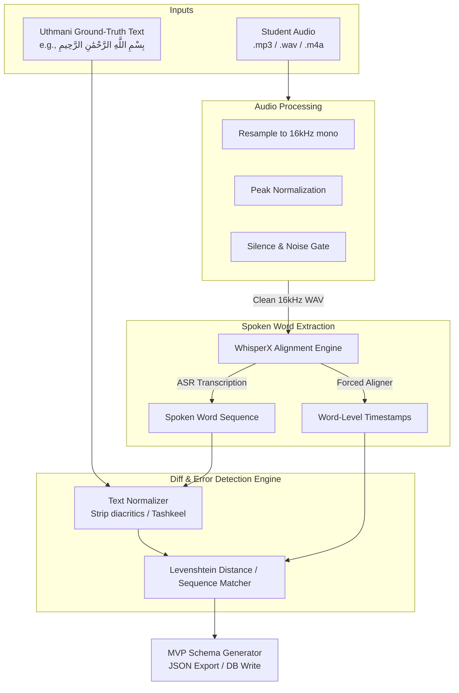

# Tajweed AI — Phase 1 MVP (Word-Level Alignment & Error Detection) Architecture

This document describes the architectural flow, component details, and algorithms for **Phase 1: Word-Level MVP**. 

The goal of this phase is to ingest student recitation audio and ground-truth Quranic text, align them at the word level, and automatically flag reading errors (omissions, insertions, and substitutions).

---

## 📌 Phase 1 Data Flow



---

## ⚙️ Detailed Component Specifications

### 1. Audio Preprocessing Pipeline
To prevent transcription errors caused by poor microphone quality or file formats:
*   **Format Standardizer**: Reads any audio format (using `FFmpeg`) and converts it to standard uncompressed **WAV (PCM 16-bit)**.
*   **Downsampler**: Resamples audio to **16,000 Hz, mono** channel.
*   **Gate Filter**: Trims leading and trailing silent regions where energy drops below `-30 dB` to optimize model latency.
*   **Expected Stack**: `librosa` or `pydub` (wrapper around FFmpeg).

### 2. WhisperX Alignment Engine
Standard Whisper struggles with exact word boundaries because it uses a sequence-to-sequence model. We use **WhisperX** to resolve this:
*   **Step A (ASR)**: Transcribe the cleaned audio segment to get raw words.
*   **Step B (Phoneme-level Forced Alignment)**: Use a phonetic Wav2Vec2 Arabic model to align phonemes within words to the audio frames, giving exact start and end timestamps.
*   **Fallback**: If WhisperX is unavailable locally, we fall back to a local pipeline using Hugging Face's `Wav2Vec2-Processor` + CTC forced alignment.

### 3. Arabic Text Normalizer
Arabic text contains diacritics (Harakaat) which alter spelling. For accurate diff calculations:
*   **Strip Harakaat**: Remove Fatha (َ), Damma (ُ), Kasra (ِ), Sukun (ْ), Shaddah (ّ), and Tanween (ً, ٌ, ٍ).
*   **Normalize Characters**: Standardize Alif variations (أ, إ, آ to ا) and Yaa/Alif Maqsura (ى to ي).
*   *Example*:
    *   Ground-truth: `بِسْمِ اللَّهِ الرَّحْمَٰنِ الرَّحِيمِ` $\rightarrow$ Normalized: `بسم الله الرحمن الرحيم`
    *   Spoken transcription: `بسم الله الرحيم` $\rightarrow$ Normalized: `بسم الله الرحيم`

### 4. Diff & Error Detection Engine
We use a **Sequence Alignment Algorithm** (e.g., Levenshtein edit distance backtrace or Python's `difflib.SequenceMatcher`) to compare the Normalized Ground-Truth Word List ($G$) against the Normalized Spoken Word List ($S$).

#### Error Classifications:
1.  **Correct Match**: The word in $S$ matches the word in $G$ in sequence. We assign the detected timestamp to the ground-truth word.
2.  **Omission (`missing_word`)**: A word exists in $G$ but is skipped in $S$. 
    *   *Detection*: Delete operation in edit distance.
3.  **Insertion (`extra_word`)**: The student inserted an extra word not in $G$.
    *   *Detection*: Insert operation in edit distance. We record the timestamp of when this insertion happened.
4.  **Substitution (`wrong_word`)**: The student mispronounced or substituted a word (e.g., saying "الرحيم" instead of "الرحمن").
    *   *Detection*: Replace operation in edit distance.

---

## 📝 Walkthrough Example (Surah Al-Fatihah, Ayah 1)

### Input Data:
*   **Ground Truth**: `بِسْمِ اللَّهِ الرَّحْمَٰنِ الرَّحِيمِ`
*   **Normalized Ground Truth ($G$)**: `["بسم", "الله", "الرحمن", "الرحيم"]`
*   **Audio Spoken**: Student misses the third word "الرحمن" (omission).
*   **ASR Spoken Words ($S$)**: `["بسم", "الله", "الرحيم"]` with timestamps `[(0.1, 0.4), (0.5, 0.9), (1.0, 1.4)]`.

### Alignment Matrix & Output Generation:

| Index | Expected ($G$) | Spoken ($S$) | Operation | Decision | Result Mapping |
| :--- | :--- | :--- | :--- | :--- | :--- |
| 0 | `بسم` | `بسم` | Match | Correct | `"start": 0.1, "end": 0.4` |
| 1 | `الله` | `الله` | Match | Correct | `"start": 0.5, "end": 0.9` |
| 2 | `الرحمن` | *None* | Delete | `missing_word` | Error flagged |
| 3 | `الرحيم` | `الرحيم` | Match | Correct | `"start": 1.0, "end": 1.4` |

#### Resulting JSON Output:
```json
{
  "surah": 1,
  "ayah": 1,
  "text": "بِسْمِ اللَّهِ الرَّحْمَٰنِ الرَّحِيمِ",
  "alignment": [
    { "word": "بسم", "start": 0.1, "end": 0.4 },
    { "word": "الله", "start": 0.5, "end": 0.9 },
    { "word": "الرحمن", "start": null, "end": null },
    { "word": "الرحيم", "start": 1.0, "end": 1.4 }
  ],
  "errors": [
    {
      "type": "missing_word",
      "word": "الرحمن",
      "expected_index": 2
    }
  ]
}
```

---

## 🛠️ Code Structure Design (Python)

To write this, we will structure the code inside the following logical functions:
1.  `preprocess_audio(input_path, output_path)`: Uses Librosa/Pydub to standardize sample rate and format.
2.  `normalize_arabic_text(text)`: Regular expression utility to strip Tashkeel and normalize Alifs/Yaas.
3.  `align_audio_and_text(audio_path, expected_text)`: Integrates WhisperX to generate timestamps.
4.  `detect_word_errors(ground_truth_list, spoken_list, timestamps)`: Performs the edit-distance diff and flags errors.
