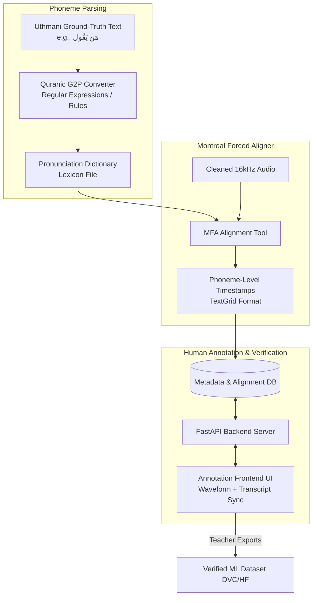

# Tajweed AI — Phase 2 Architecture (Phoneme Alignment & Human-in-the-Loop UI)

This document describes the architectural flow, component details, and interface specifications for **Phase 2: Phoneme Alignment & Human-in-the-Loop (HIL) Annotation UI**.

This phase enables letter-level verification (crucial for spotting subtle Tajweed mistakes) and provides a visual interface for experts to correct, verify, and export the dataset.

---

## 📌 Phase 2 Data Flow



---

## ⚙️ Detailed Component Specifications

### 1. Quranic Grapheme-to-Phoneme (G2P) Converter
A standard G2P maps letters to sound symbols (phonemes). The Quranic G2P maps complex Uthmani diacritics into target phonetic sequences to represent *correct Tajweed*.

*   **Lexicon Generation**: It generates an MFA-compatible dictionary (`lexicon.txt`) where each unique Quranic word points to its phoneme list.
*   **Dynamic Tajweed Rules applied in G2P**:
    *   **Silent Letters**: Skip characters like silent Alif (ا) and Waaw (و) indicated by a small circle (Dairah Mustadeerah).
    *   **Idgham (Assimilation)**: Convert sequences like Noon-Sukun (نْ) or Tanween followed by (ي, ر, م, ل, و, ن) into doubled versions of the following letters. E.g., `مَن يَقُول` (Man Yaquul) $\rightarrow$ `/m/ /a/ /y/ /y/ /a/ /q/ /uu/ /l/`.
    *   **Ikhfa (Nasalization)**: Retain the Noon sound but tag it with a nasal/Ghunnah phoneme modifier `/N_gn/` to instruct the aligner to look for a nasal duration.

### 2. Montreal Forced Aligner (MFA) Integration
*   **Dictionary**: The lexicon file maps words (e.g., `بِسْمِ`) to phonemes (e.g., `b i s m`).
*   **Acoustic Model**: Uses a pre-trained Arabic acoustic model (trained on LibriSpeech Arabic or similar dataset).
*   **Processing**: MFA processes the audio alongside the generated dictionary to output a **TextGrid** file containing the exact boundaries of every phoneme (e.g., word "بسم" runs from `0.12` to `0.54`, letter "ب" is `0.12 - 0.22`, "س" is `0.22 - 0.48`, "م" is `0.48 - 0.54`).

### 3. Annotation UI (Frontend Dashboard)
A web interface built using HTML5/React and standard components to enable fast teacher reviews.

```
┌───────────────────────────────────────────────────────────┐
│ [ Surah 1, Ayah 1 ]                        [ Reciter: S-1]│
├───────────────────────────────────────────────────────────┤
│                     WAVEFORM DISPLAY                      │
│   /\  /\    /\      /\/\    /\      /\      /\/\/\        │
│  /  \/  \  /  \    /    \  /  \    /  \    /      \       │
│ 0.0s     0.5s     1.0s    1.5s    2.0s    2.5s     3.0s   │
├───────────────────────────────────────────────────────────┤
│ TRANSCRIPT:   بِسْمِ   اللَّهِ   الرَّحْمَٰنِ   الرَّحِيمِ  │
│              (Active word highlights in real-time)        │
├───────────────────────────────────────────────────────────┤
│ DETECTED ERRORS:                                          │
│ [X] Word 'الرحمن' skipped at 1.4s         [Approve][Reject]│
│ [X] Madd duration insufficient at 2.1s    [Approve][Reject]│
│                                                           │
│ [ + Add Custom Error Tag ]                [ Save & Commit ]│
└───────────────────────────────────────────────────────────┘
```

#### Core UI Features:
*   **Waveform Player**: Integrated with `wavesurfer.js`. Shows audio waveform and boundaries of each word/phoneme as vertical timeline grids.
*   **Word Auditing**: Clicking any word plays *only* that timestamped segment of the audio.
*   **Dynamic Error Tagging**: If the teacher rejects the automatic flag, they can delete it. If they find a new error, they click a word and choose the error type (e.g., Makhraj error, Madd mistake, Ghunnah mistake).

### 4. FastAPI Backend & Database
*   **Metadata DB**: SQLite database containing schemas for:
    *   `recitations`: Audio file details, surah, ayah, student metadata.
    *   `alignments`: Phone-level and word-level start/end timestamps.
    *   `flags`: Auto-detected errors and human-verified actions.
*   **REST API Endpoints**:
    *   `GET /ayah/{surah}/{ayah}`: Returns ground truth text and associated alignment schema.
    *   `GET /audio/{audio_id}`: Streams the processed WAV file.
    *   `POST /verify/{audio_id}`: Saves teacher modifications, marking the record as `teacher_verified = true`.

---

## 📝 Example Phoneme Dictionary (`lexicon.txt`)
MFA requires a dictionary mapped to phonetic representations (using Buckwalter or standard phonemes):

```
بِسْمِ       b i s m
اللَّهِ      a l l a h
الرَّحْمَٰنِ   a r r a h m a a n
الرَّحِيمِ   a r r a h ee m
```

---

## 🚀 Building the Foundation

We can initialize the Phase 2 backend using:
*   **FastAPI** for API design.
*   **Pydantic** for enforcing the schema.
*   **SQLAlchemy** for storing phoneme alignments in SQLite.
