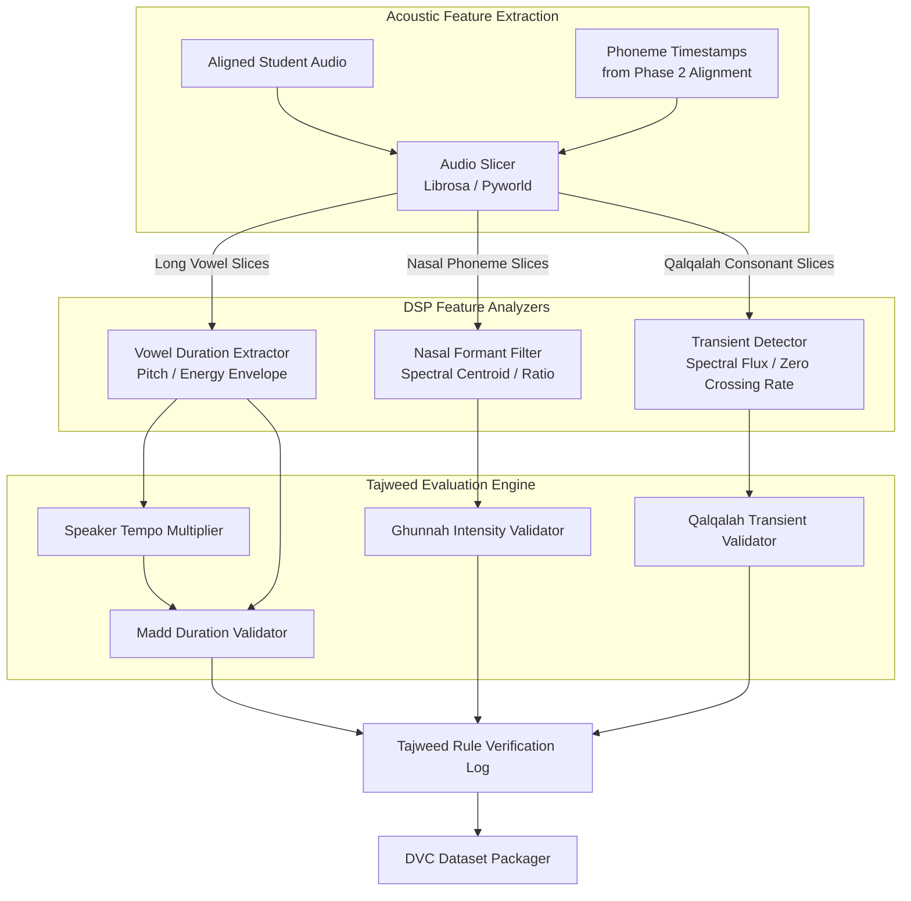

# Tajweed AI — Phase 3 Architecture (Tajweed Rule Engine & Advanced DSP)

This document describes the architectural flow, digital signal processing (DSP) methodologies, and feature extraction algorithms for **Phase 3: Tajweed Rule Engine & Advanced DSP**.

This phase implements the mathematical evaluation of specific Tajweed rules (Madd, Ghunnah, and Qalqalah) on the audio segments aligned in Phase 2.

---

## 📌 Phase 3 Data Flow



---

## ⚙️ Detailed Component Specifications

### 1. Speaker Tempo Multiplier & Madd (Elongation) Validator
A Madd rule indicates how many "counts" (Harakah) a vowel should be elongated. 
*   **The Challenge**: A "count" is relative. Fast reciters have shorter counts; slow reciters have longer counts.
*   **Tempo Extraction**:
    1. Calculate the average duration of normal (short) vowels in the recitation (e.g., standard Fatha, Damma, Kasra) to establish the speaker's baseline syllable length ($T_{base}$).
    2. Define the expected Madd length dynamically as a multiplier of $T_{base}$:
       *   *Madd Thabi'ee* (2 counts) $\rightarrow$ Expected duration: $\approx 2 \times T_{base}$.
       *   *Madd Wajib/Ja'iz* (4-5 counts) $\rightarrow$ Expected duration: $\approx 4 \times T_{base}$ to $5 \times T_{base}$.
*   **Validation Logic**:
    *   Slice the target Madd phoneme (e.g., `/aa/`, `/ii/`, `/uu/`).
    *   Measure the length of continuous audio where root-mean-square (RMS) energy remains above a threshold.
    *   If the measured duration falls below $80\%$ of the expected speed-adjusted length, flag `tajweed_madd_insufficient`.

### 2. Ghunnah (Nasalization) Spectral Analyzer
Ghunnah is a nasal sound held for 2 counts on letters like Noon (ن) and Meem (م).
*   **Acoustic Signature**: 
    *   Speaking through the nose creates a resonance band (formant) around **250Hz - 1000Hz** and dampens mid-frequencies.
*   **Feature Extraction**:
    *   Compute the **Spectrogram** (using Short-Time Fourier Transform - STFT).
    *   Calculate the **Spectral Energy Ratio**:
        $$\text{Ratio} = \frac{\text{Energy in Nasal Band (250Hz - 1000Hz)}}{\text{Energy in Oral Band (1000Hz - 4000Hz)}}$$
*   **Validation Logic**:
    *   Measure the duration of the high nasal ratio inside the target letter.
    *   If the ratio is low, or if the duration of nasalization is shorter than $2 \times T_{base}$, flag `tajweed_ghunnah_failed` or `tajweed_ghunnah_short`.

```
Frequency (Hz)
 ▲
 │   High energy here indicates nasal resonance (Ghunnah)
 ├───▒▒▒▒▒▒▒▒▒▒▒▒▒▒▒▒▒▒▒ (250Hz - 1000Hz)
 │
 ├───░░░░░░░░░░░░░░░░░░░ (Dampened Oral Mid-range)
 └────────────────────────► Time (seconds)
```

### 3. Qalqalah (Echoing) Transient Detector
Qalqalah involves a rapid release of air after a stop consonant (ق، ط، ب، ج، د).
*   **Acoustic Signature**: 
    1. A silent gap (closure period).
    2. A sharp burst of noise (transient release).
*   **Feature Extraction**:
    *   **Zero Crossing Rate (ZCR)**: Sudden spike indicates the release burst.
    *   **Spectral Flux**: Measures how quickly the frequency spectrum changes from silence to transient burst.
*   **Validation Logic**:
    *   Check if there is a silence period ($< -40\text{dB}$) within the phoneme followed by a transient spike.
    *   If no transient burst is detected before the next phoneme starts, flag `tajweed_qalqalah_missing`.

---

## 📦 Dataset Versioning & ML Publishing
Once annotations and DSP logs are verified, they must be formatted for machine learning tasks.
*   **DVC (Data Version Control)**:
    *   The raw audio and metadata are versioned with git-like hashing.
    *   Ensures that models trained in future steps can reference identical training sets.
*   **Hugging Face Datasets Pipeline**:
    *   Serialize outputs into `.parquet` format containing:
        *   `audio`: Raw audio array + sampling rate.
        *   `transcription`: Normalized and original Uthmani text.
        *   `phonemes`: List of phonemes and relative start/end float arrays.
        *   `labels`: Binary classification arrays showing rule compliance (e.g. `[madd_correct: 1, ghunnah_correct: 0]`).
