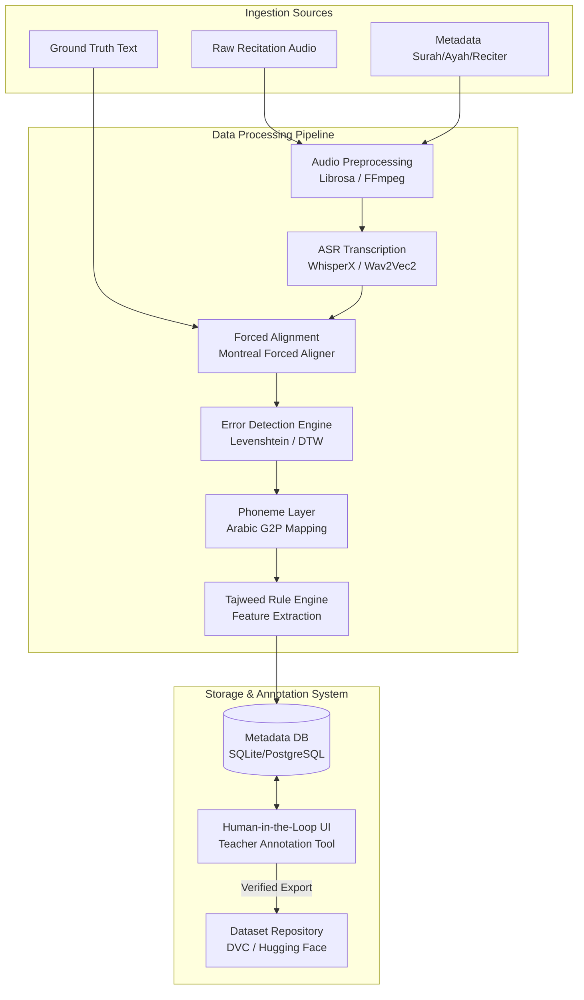

# Tajweed AI Dataset + Alignment System Architecture

This document details the system design, data flow, schema specifications, and technology stack for building the **Tajweed AI Dataset Generation Pipeline**. 

The primary goal is to turn raw Quranic recitation audio and Uthmani ground-truth text into a high-quality, verified dataset suitable for training speech models to evaluate Tajweed (recitation rules) and pronunciation accuracy.

---

## 📌 System Overview

The system operates as an **ML Data Engine** that implements a pipeline processing flow: ingest raw audio and text, align them at the word and phoneme level, detect errors, run Tajweed rules validation, and surface flagged discrepancies to human experts for verification before storing them in a versioned dataset.



## 🧠 The Evaluation Strategy: Hybrid DSP + Data-Driven Approach

To achieve maximum accuracy and robustness, the pipeline does not rely solely on deep learning models. Instead, it utilizes a **hybrid architecture** that combines **Data-Driven Deep Learning Models** with **Digital Signal Processing (DSP) mathematical rules**:

1. **Data-Driven Models (AI)**:
   * **Role**: Segment raw audio and locate the exact timestamps of individual words and phonemes.
   * **Reason**: Speech boundaries, accents, voice pitches, and background noise are too variable for rigid math equations. Pre-trained and fine-tuned ASR/forced alignment models (WhisperX, Wav2Vec2) are excellent at robustly parsing speech across different speakers (children, adults, male, female).
2. **DSP Rules (Mathematics)**:
   * **Role**: Evaluate specific Tajweed rules (e.g. Madd elongation duration, Ghunnah nasal resonance, Qalqalah transients) on the sliced segments.
   * **Reason**: Measuring a 1.2-second elongation or the 250Hz–1000Hz frequency dominance of a nasal sound is a deterministic mathematical problem. Doing this via pure DSP rules bypasses the need for a massive, non-existent dataset of labeled student errors.

This hybrid approach makes the engine highly speaker-independent and provides objective, explainable feedback on Tajweed mistakes.

---

## ⚙️ Pipeline Components & Data Flow

### 1. Audio Preprocessing
*   **Purpose**: Standardize incoming audio inputs to maximize downstream ASR and forced alignment accuracy.
*   **Operations**:
    *   **Resampling**: Downsample/upsample all input audios to 16kHz mono (the standard input rate for Wav2Vec2/Whisper).
    *   **Normalization**: Peak normalization to avoid clipping, plus loudness normalization (EBU R128).
    *   **Denoising**: Spectral subtraction or bandpass filtering (80Hz to 8kHz) to eliminate background noise.
    *   **Silence Trimming**: Remove leading/trailing silences to prevent alignment issues.
*   **Libraries**: `Librosa`, `pydub`, `soundfile`, `FFmpeg`.

### 2. Automatic Speech Recognition (ASR)
*   **Purpose**: Generate a rough transcript and word boundaries directly from the user's audio.
*   **Approach**:
    *   Use **WhisperX** or a fine-tuned **Wav2Vec2-large-xlsr-53-arabic** model.
    *   WhisperX is preferred because it incorporates VAD (Voice Activity Detection) and phoneme-level boundary alignment models (using Wav2Vec2 alignments under the hood).
*   **Output**: Segmented text transcripts with approximate word-level timestamps.

### 3. Forced Alignment
*   **Purpose**: Align the canonical, ground-truth Uthmani Quranic text with the audio file.
*   **Mechanism**:
    *   ASR transcription is often noisy or modified by student errors. Forced alignment maps the *expected* ground-truth words onto the audio timeline.
    *   **Tools**: **Montreal Forced Aligner (MFA)** or **Chigirev/Wav2Vec2 alignment**. MFA utilizes Kaldi recipes which are highly robust for Arabic phone-level alignments once trained/supplied with an Arabic acoustic model and pronunciation dictionary.
*   **Phoneme Mapping**: Since Uthmani text contains complex diacritics (Tashkeel) and Tajweed markings, a Grapheme-to-Phoneme (G2P) converter translates the text into phonetic representation (e.g., Buckwalter transliteration or IPA).

### 4. Word-Level Error Detection (MVP Engine)
*   **Purpose**: Compare the ASR-transcribed text against the ground-truth text to isolate word-level errors.
*   **Algorithm**:
    *   Apply **Levenshtein Distance** (or Dynamic Time Warping (DTW) on character sequences) to match ASR outputs against ground truth.
    *   Classify differences into three error types:
        1.  `missing_word`: The word exists in ground truth but was omitted in audio.
        2.  `extra_word`: The speaker inserted a word not in the ground truth.
        3.  `wrong_word`: The speaker substituted a word with a different one.

### 5. Phoneme Analysis Layer
*   **Purpose**: Pinpoint letter-level mispronunciations (e.g., confusing *Qaf* (ق) with *Kaf* (ك), or *Sad* (ص) with *Seen* (س)).
*   **Mechanism**:
    *   Using the phoneme boundaries obtained from forced alignment, slice the audio per phoneme.
    *   Evaluate spectral properties (MFCCs, spectral centroid) or compute cosine similarity of embeddings from an acoustic model fine-tuned for phoneme classification.
    *   Compare the actual phoneme spoken against the target phoneme.

### 6. Tajweed Rule Engine
*   **Purpose**: Programmatically validate specific recitation rules.
*   **Initial Rules Targeted**:
    *   **Madd (Elongation) Duration**: Compare the duration of the elongation vowel phoneme (e.g., *aa*, *ee*, *oo*) to surrounding short vowels. Standardize duration count based on the speaker's average speaking rate.
    *   **Ghunnah (Nasalization)**: Analyze spectral energy distribution in the nasal cavity frequency range (typically 1–2 kHz boost) during nasalized letters (*Noon* (ن) / *Meem* (م) with Shaddah, Ikhfa, or Idgham).
    *   **Qalqalah (Echoing/Bouncing)**: Detect short silent gaps followed by a transient burst at the end of Qalqalah letters (ق، ط، ب، ج، د) when they have a Sukun.

---

## 🗃️ Data Schema Specification

To ensure interoperability between the Python pipeline, database, and HIL UI, the following schema designs will be used.

### Ingestion Metadata Schema (`audio_metadata`)
```json
{
  "$schema": "http://json-schema.org/draft-07/schema#",
  "title": "AudioMetadata",
  "type": "object",
  "properties": {
    "audio_id": { "type": "string" },
    "surah": { "type": "integer", "minimum": 1, "maximum": 114 },
    "ayah": { "type": "integer", "minimum": 1 },
    "reciter_id": { "type": "string" },
    "reciter_type": { "type": "string", "enum": ["teacher", "student"] },
    "audio_format": { "type": "string" },
    "duration_seconds": { "type": "number" }
  },
  "required": ["audio_id", "surah", "ayah", "reciter_id", "reciter_type"]
}
```

### Alignment and Error Schema (`pipeline_output`)
This JSON is output by the processing pipeline and saved into the database for UI ingestion.

```json
{
  "audio_id": "recitation_001.wav",
  "surah": 1,
  "ayah": 1,
  "text": "بِسْمِ اللَّهِ الرَّحْمَٰنِ الرَّحِيمِ",
  "global_metrics": {
    "avg_speaking_rate_wpm": 65,
    "confidence_score": 0.94
  },
  "alignment": [
    {
      "word_index": 0,
      "word": "بِسْمِ",
      "start": 0.12,
      "end": 0.54,
      "confidence": 0.98,
      "phonemes": [
        { "phoneme": "b", "start": 0.12, "end": 0.22 },
        { "phoneme": "i", "start": 0.22, "end": 0.35 },
        { "phoneme": "s", "start": 0.35, "end": 0.48 },
        { "phoneme": "m", "start": 0.48, "end": 0.54 }
      ]
    },
    {
      "word_index": 1,
      "word": "اللَّهِ",
      "start": 0.58,
      "end": 1.10,
      "confidence": 0.95,
      "phonemes": [
        { "phoneme": "a", "start": 0.58, "end": 0.68 },
        { "phoneme": "l", "start": 0.68, "end": 0.82 },
        { "phoneme": "l", "start": 0.82, "end": 0.94 },
        { "phoneme": "a", "start": 0.94, "end": 1.02 },
        { "phoneme": "h", "start": 1.02, "end": 1.10 }
      ]
    }
  ],
  "errors": [
    {
      "error_id": "err_001",
      "type": "pronunciation_mismatch",
      "severity": "high",
      "target_word_index": 0,
      "target_phoneme_index": 3,
      "expected": "m",
      "detected": "n",
      "timestamp_start": 0.48,
      "timestamp_end": 0.54,
      "rule_violated": "Makhraj (Articulation Point)"
    },
    {
      "error_id": "err_002",
      "type": "tajweed_duration_insufficient",
      "severity": "medium",
      "target_word_index": 2,
      "expected_duration_seconds": 1.2,
      "detected_duration_seconds": 0.5,
      "timestamp_start": 1.45,
      "timestamp_end": 1.95,
      "rule_violated": "Madd Arid Lis-Sukun"
    }
  ],
  "teacher_verified": false,
  "verified_by": null,
  "verified_at": null
}
```

---

## 🎨 Human-in-the-Loop Annotation UI
A responsive interface for teachers to check the pipeline's output.

### Functional Requirements
1.  **Audio Player**: Visual waveform synchronized with aligned words. 
2.  **Interactive Transcription**: Displays Uthmani text where words highlight in real-time as the audio plays.
3.  **Error Inspector Panel**: Highlight pipeline-detected errors with options to **Approve**, **Reject**, or **Edit** (e.g., change error type or timestamp boundaries).
4.  **Manual Tagging**: Allow teachers to click any word/phoneme and manually insert a Tajweed mistake.
5.  **Export & Commit**: Save corrections back to the dataset repository.

---

## 🛠️ Technology Stack Recommendations

*   **Programming Language**: Python 3.10+ (standard ML ecosystem).
*   **Audio DSP**: `librosa`, `soundfile`, `scipy.signal` for feature extraction.
*   **Machine Learning Models**:
    *   **WhisperX**: Transcription and forced alignment boundaries.
    *   **Hugging Face `transformers`**: Fine-tuned Wav2Vec2 Arabic acoustic models.
*   **Forced Alignment Tooling**:
    *   **Montreal Forced Aligner (MFA)**: For phoneme-level alignments requiring custom dictionary mappings.
*   **Database**: SQLite (for MVP local usage) or PostgreSQL (for collaborative annotation environments) using SQLAlchemy.
*   **Backend Server**: FastAPI (lightweight, async, natively supports JSON schema validation via Pydantic).
*   **Frontend UI**: Vite + React or pure HTML5 with standard Web Audio API and Wavesurfer.js for audio visualizers.
*   **Dataset Versioning**: `DVC` (Data Version Control) paired with `Git` for code/metadata tracking.

---

## 🚀 MVP Implementation Roadmap

```
┌──────────────────────────────────────────────────────────┐
│ PHASE 1: Word-Level MVP (Weeks 1-4)                      │
│ - Implement Resampling/Normalization pipeline            │
│ - Integrate WhisperX for word timestamps                 │
│ - Build Levenshtein-based word insertion/omission engine  │
│ - Design base SQLite schemas & local JSON exports        │
└─────────────┬────────────────────────────────────────────┘
              │
              ▼
┌──────────────────────────────────────────────────────────┐
│ PHASE 2: Phoneme Alignment & HIL UI (Weeks 5-8)          │
│ - Build Arabic G2P converter for Uthmani script          │
│ - Integrate MFA for letter-level timestamping            │
│ - Develop Annotation UI with Waveform-Text synchronization│
│ - Implement error review & verification panel            │
└─────────────┬────────────────────────────────────────────┘
              │
              ▼
┌──────────────────────────────────────────────────────────┐
│ PHASE 3: Tajweed Rule Engine & Advanced DSP (Weeks 9-12) │
│ - Develop Madd duration calculation (speaking rate-aware)│
│ - Write Ghunnah spectral analysis model                  │
│ - Deploy versioned dataset builder (Hugging Face / DVC)  │
└──────────────────────────────────────────────────────────┘
```
