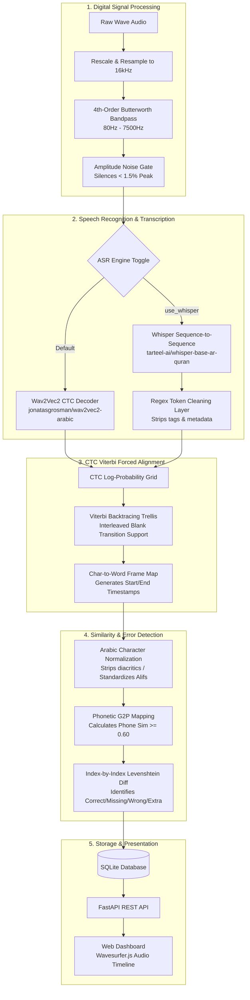

# 🏛️ Tajweed AI System Architecture Spec

This document details the complete, working production architecture of **Tajweed AI**—a high-accuracy Arabic speech alignment and pronunciation error detection platform.

---

## 📌 Architectural Workflow Overview

The system processes raw, noisy student recitations and matches them against canonical Quranic scriptures using the following multi-stage pipeline:



---

## ⚙️ Detailed Component Breakdown

### 1. Digital Signal Processing (DSP) Preprocessing
*   **Target File**: `src/preprocessing/audio.py`
*   **Resampling**: Standardizes all audio input streams to **16,000 Hz, mono-channel, 16-bit PCM WAV** to ensure compatibility with Hugging Face models.
*   **Butterworth Bandpass Filter**: Passes audio through a 4th-order zero-phase Butterworth filter with cutoff frequencies at **80 Hz** (to eliminate low-frequency mains hum and desk rumble) and **7500 Hz** (to eliminate high-frequency mic hiss).
*   **Amplitude Noise Gate**: Automatically silences any frames where absolute amplitude is below **1.5% of the absolute peak**. This prevents low-level ambient room noise from triggering false phonetic alignments during silence.

### 2. Dual-ASR Decoding Options
*   **Target File**: `src/alignment/aligner.py`
*   **Wav2Vec2 CTC Decoder (Default)**: Utilizes the Robust general conversational model `jonatasgrosman/wav2vec2-large-xlsr-53-arabic`. Because it is an encoder-only model, it has **zero risk of early cutoff or loops**, and produces prediction scores for every frame.
*   **Whisper Quranic Decoder (Optional Toggle)**: Utilizes `tarteel-ai/whisper-base-ar-quran` (145M parameters). It runs context-aware autoregressive decoding. 
*   **Whisper Token Cleaner**: Whisper outputs often contain special tags like `<|ar|><|transcribe|><|notimestamps|>` or English metadata. A custom regex-based cleaning layer strips all non-Arabic tag brackets before character mapping:
    ```python
    transcription = re.sub(r"<\|.*?\|>", "", transcription)
    transcription = re.sub(r"[a-zA-Z]", "", transcription)
    transcription = re.sub(r"\s+", " ", transcription).strip()
    ```

### 3. Viterbi CTC Forced Alignment Trellis
*   **Target File**: `src/alignment/aligner.py`
*   **Log-Probabilities**: Extracts emissions logits from the Wav2Vec2 layer and converts them into normalized log-probabilities.
*   **Interleaved Trellis**: Generates a 2D dynamic programming grid of size `[Frames, 2 * Characters + 1]` to model transitions between characters with interleaved CTC blank tokens (`<pad>`).
*   **Backtracing & Mapping**: Performs a dynamic backtrace from the highest-probability final state. The mapping array (`ctc_word_map`) assigns each character boundary back to its parent word index, outputting start and end timestamps for every word.

### 4. Phonetic & Normalized Character Similarity
*   **Target File**: `src/alignment/error_detector.py`
*   **Diacritic Stripping**: Strips all short vowel diacritics (Fathah, Dammah, Kasrah, Sukun, Shaddah) and Quranic signs.
*   **Alif Normalization**: Converts all Alif variations (`أ`, `إ`, `آ`, `ى`) into a standard Alif (`ا`).
*   **Phonetic G2P Mapping**: If character similarity falls below standard threshold, a Grapheme-to-Phoneme parser transliterates the words to check how they sound.
*   **Relaxed Fallback Threshold**: Compares normalized character similarity and phone-level similarity. If either exceeds **`0.60`**, the word is accepted as a match, preventing false flags on minor ASR spelling slips.

### 5. Index-by-Index Levenshtein Error Detector
*   **Target File**: `src/alignment/error_detector.py`
*   **Sequential Comparison**: Runs character-level sequence matching to trace alignment paths index-by-index.
*   **Classification Rules**:
    *   **`correct`**: The spoken word matches the expected word (or exceeds the phonetic threshold).
    *   **`missing`**: The expected word exists in ground truth but was omitted by the speaker (assigned `start: null`, `end: null`).
    *   **`substitution`**: The speaker substituted the expected word with a different word (assigned error type `wrong_word`).
    *   **`extra_word`**: The speaker added an insertion not present in the script.

### 6. SQLite Database & Storage Schema
*   **Target File**: `src/server/app.py`
*   **`recitations` table**: Stores metadata (`id`, `audio_id`, `surah_number`, `ayah_number`, `reciter_id`, `duration`).
*   **`word_alignments` table**: Stores every word on the timeline (`recitation_id`, `word_index`, `word`, `start_time`, `end_time`, `status`).
*   **`recitation_errors` table**: Stores specific mistakes (`recitation_id`, `error_type`, `expected`, `detected`, `timestamp_start`, `timestamp_end`).

### 7. Interactive Frontend Presentation
*   **Wavesurfer Timeline visualizer**: Displays a dynamic waveform. Clicking on any word on the text visualizer seeks the audio directly to its start/end timestamp.
*   **Color-coded representation**: 
    *   ⚪ **White/Green**: Correct pronunciations.
    *   ⚪ **Dark Grey**: Omitted/skipped words.
    *   🔴 **Red**: Substitution mistakes or extra insertions.

---

## 📊 Sample Output Schema

Below is the standard JSON structure exported by the pipeline:

```json
{
  "audio_id": "surah_falaq_2.wav",
  "surah": 113,
  "ayah": 1,
  "reciter_id": "student_01",
  "text": "بِسْمِ اللَّهِ الرَّحْمَٰنِ الرَّحِيمِ قُلْ أَعُوذُ بِرَبِّ الْفَلَقِ مِن شَرِّ مَا خَلَقَ ...",
  "alignment": [
    {
      "word": "بِسْمِ",
      "start": null,
      "end": null,
      "status": "substitution"
    },
    {
      "word": "بِرَبِّ",
      "start": 1.2,
      "end": 1.48,
      "status": "correct"
    }
  ],
  "errors": [
    {
      "type": "wrong_word",
      "expected": "بِسْمِ",
      "detected": "والْرُوذُ",
      "timestamp_start": 0.56,
      "timestamp_end": 1.04
    },
    {
      "type": "missing_word",
      "word": "اللَّهِ",
      "expected_index": 1
    }
  ]
}
```
